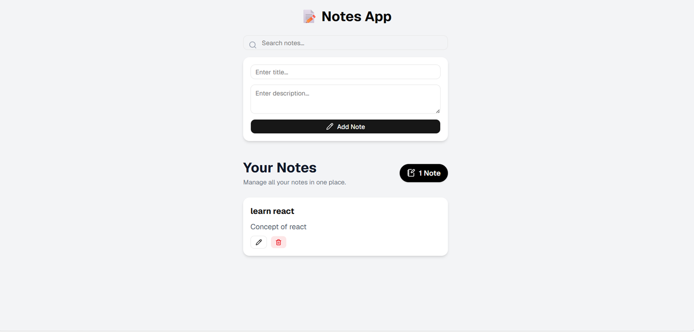

# 📝 Notes App

A simple and responsive **Notes App** built using **React**, **Vite**, **Tailwind CSS**, and **shadcn/ui**. It allows users to create, edit, and delete notes with a clean and user-friendly interface.

---

## 📸 Screenshot

Add your project screenshot inside the **public** folder.





---

## ✨ Features

* 📝 Create notes
* ✏️ Edit notes
* 🗑️ Delete notes
* 💾 Save notes
* 📱 Responsive Design
* 🎨 Clean UI

---

## 🛠️ Tech Stack

* React
* Vite
* Tailwind CSS
* shadcn/ui
* Lucide React

---

## 🚀 Getting Started

Clone the repository

```bash
git clone https://github.com/your-username/notes_app.git
```

Go to the project folder

```bash
cd notes_app
```

Install dependencies

```bash
npm install
```

Start the development server

```bash
npm run dev
```

---

## 📦 Build

```bash
npm run build
```

---

## 👩‍💻 Author

**Srushti Malod**
